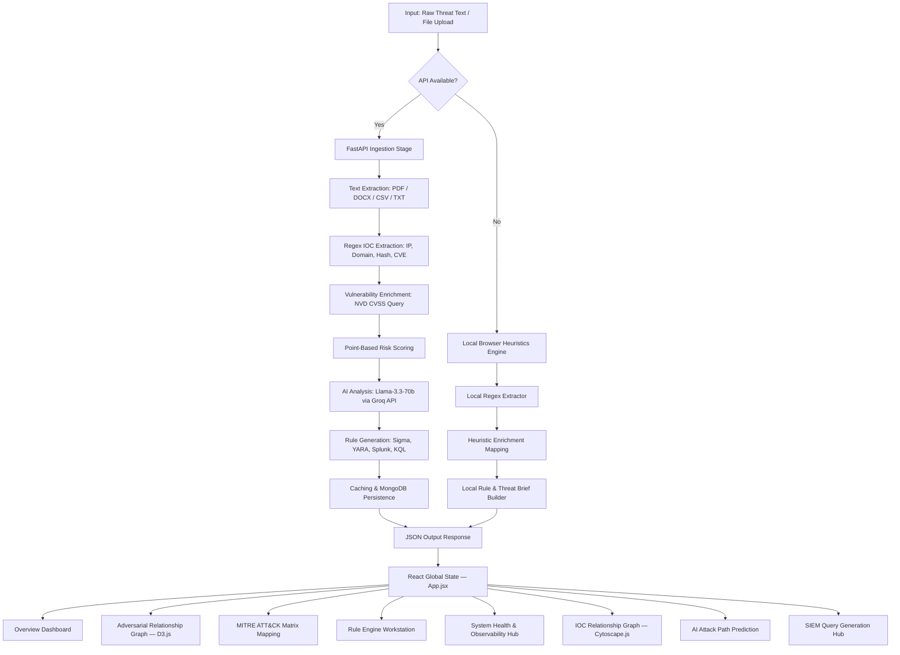

# SISA Sentinel: AI Threat Intelligence & Attack Mapping Platform

SISA Sentinel is a premium, real-time **AI-Powered Threat Intelligence and Adversarial Attack Mapping Platform** built for the **SISA AI-Prism Hackathon 2026**. The platform automates threat ingestion, extracts Indicators of Compromise (IOCs), queries vulnerability directories, assesses risk scoring under rigorous mathematical frameworks, maps tactics to the MITRE ATT&CK® matrix, generates multi-format SIEM/detection rules, and displays network relations interactively.

---

## 🏗️ Architecture & Pipeline Flow

The platform is designed with a high-performance **modular decoupled architecture**:
*   **Frontend**: A modern React (Vite) application utilizing a customized design system built with custom CSS, glassmorphism aesthetics, responsive layouts, micro-animations, and interactive D3.js force-directed topology maps plus Cytoscape.js IOC relationship graphs.
*   **Backend**: An asynchronous Python FastAPI server serving RESTful APIs, integrating MongoDB for data persistence, memory caching for identical inputs, and NVD + Groq LLM orchestration.
*   **Hybrid Engine**: Built with a **High-Fidelity Client-Side Fallback**. If the backend FastAPI server or database is offline, the React frontend seamlessly runs a local browser-based parsing and analysis engine using matching heuristics, local regex extraction, and deterministic rule templates.
*   **Global State Synchronization**: A single `activeAnalysis` state object is propagated from `App.jsx` into every tab/component. All pages — including the bonus feature tabs — automatically re-render and re-fetch results using the latest analyzed threat input.

### Data Ingestion & Analysis Pipeline (Mermaid)



### Backend Module Map

```mermaid
graph LR
    MAIN[main.py — FastAPI App] --> ANALYZE[/api/analyze-threat]
    MAIN --> HEALTH[/health]
    MAIN --> HIST[/api/analyses]
    MAIN --> ATCK[attack_path.py — /api/attack-path]
    MAIN --> IOCG[ioc_graph.py — /api/ioc/graph]
    MAIN --> SIEM[siem.py — /api/siem/queries]
    MAIN --> YARA[yara.py — /api/yara/rule]
    MAIN --> FEED[threat_feed.py — /api/threat-feed]

    ANALYZE --> EXT[services/extractor.py]
    ANALYZE --> ENR[services/enrichment.py]
    ANALYZE --> RISK[services/risk.py]
    ANALYZE --> AI[services/ai.py — Groq LLM]
    ANALYZE --> RULES[services/rules.py]
    ANALYZE --> ING[services/ingestion.py]
    ANALYZE --> CACHE[cache.py — MongoDB]
```

---

## ⚡ Core Functionality

### 1. Ingestion Pipeline (`F1`)
*   Supports both raw text and file uploads (supporting `.pdf`, `.docx`, `.doc`, `.csv`, `.txt`, `.json`) up to **10MB**.
*   Utilizes python packages `PyPDF2` and `python-docx` on the backend to extract document contents.
*   Uses a fast HTML `FileReader` wrapper client-side to read text when offline.

### 2. Multi-Regex IOC Extraction (`F2`)
*   Extracts structural network and file indicators via high-speed regular expressions:
    *   **Network Elements**: IPv4 addresses, domains, URLs, and emails.
    *   **File Elements**: MD5, SHA-1, and SHA-256 hashes.
    *   **Vulnerabilities**: CVE-IDs (e.g., `CVE-2023-4966`).

### 3. Intel Enrichment & Attribution (`F3`)
*   Performs dynamic lookups for extracted CVE-IDs against the **NVD API** or local database configurations, bringing back description data, CVSS ratings, severity ranks, and public exploit POC availability.
*   Enriches results with malware family profiles and known APT actors (e.g., *APT29 / Cozy Bear*, *APT41 / BARIUM*, *LockBit Group*).

### 4. Dynamic Risk Scoring Engine (`F5`)
Implements a mathematical risk calculation based on point-scoring parameters (capped at 100):
$$\text{Risk Score} = \min(100, \text{CVSS Factor} + \text{Exploit PoC Available} + \text{Malware Assoc} + \text{Actor Known} + \text{IOC Reputation})$$

*   **CVSS Factor**: Critical (CVSS > 9) = 30 pts | High (CVSS 7–9) = 20 pts | Medium (CVSS 4–7) = 10 pts.
*   **Exploit PoC Available**: 25 pts.
*   **Malware Associated**: 15 pts.
*   **Known Threat Actor**: 10 pts.
*   **IOC Reputation (Blacklist hit)**: 20 pts.
*   **Risk Level Mapping**:
    *   `Critical` (>80)
    *   `High` (61–80)
    *   `Medium` (31–60)
    *   `Low` (0–30)
*   Displayed via an animated **SVG radial gauge** with tick marks and a colour-coded level banner, alongside a weighted contributing-factors grid.

### 5. AI-Powered Threat Briefs (`F4` & `F6`)
*   Communicates with the **Groq API** running `llama-3.3-70b-versatile` to produce dynamic incident summaries, structured attack scenario timelines, and business risk assessments.
*   Maps tactics and techniques into the standard **MITRE ATT&CK Matrix** (e.g., *Initial Access (T1190)*, *Execution (T1204)*) and validates technique IDs against a local MITRE Catalog JSON data source.
*   Recommends mitigation vectors divided into: *Immediate Actions*, *Long-term Remediation*, and *Continuous Monitoring*.

### 6. Detection Rule & SIEM Workstation (`F7`)
*   Compiles rules in four SIEM formats:
    *   **Sigma (YAML)**: Standardized EDR search queries.
    *   **YARA**: Hex/string byte matches for binaries.
    *   **Splunk SPL**: Host/network searching logs.
    *   **Microsoft Sentinel KQL**: Azure DeviceEvents/NetworkConnections queries.
*   Includes a dedicated **Rule Workstation** tab allowing analysts to inspect, modify, and copy generated code rules.

### 7. Interactive D3.js Force Layout Graph (`F8`)
*   Builds an animated node-link relationship chart visualizing the connections between the threat incident, actors, malware files, CVSS vulnerabilities, and individual IOC network targets.
*   Includes a sidebar **Context Inspector** to pin and inspect detailed metadata on specific nodes.

---

## 🚀 Bonus / Extra Features

### B1. AI Attack Path Prediction (`/attack-path`)
*   A dedicated **Attack Path Prediction** tab generates a full cyber kill-chain timeline from threat input.
*   **Backend** (`attack_path.py`): Sends threat text to `llama-3.3-70b-versatile` via Groq with a structured prompt requesting a kill-chain JSON (title, summary, 5–8 steps with MITRE technique IDs). Falls back to a curated static kill-chain when the Groq key is absent.
*   **Frontend** (`AttackPath.jsx`): Renders each step as a color-coded animated timeline card showing step number, kill-chain phase name (with emoji icon), MITRE technique badge, and phase description.
*   **Global sync**: When a new analysis is submitted, `activeAnalysis.raw_input` is automatically passed and the attack path re-generates for that threat.
*   **Custom input mode**: Analysts can toggle a custom textarea to generate an attack path for any arbitrary threat description without running the full pipeline.

### B2. IOC Relationship Graph — Cytoscape.js (`/ioc-graph`)
*   A second interactive graph (distinct from the D3.js force graph) powered by **Cytoscape.js** visualises IOC-to-entity relationships.
*   **Backend** (`ioc_graph.py`): Exposes `GET /api/ioc/graph` returning typed nodes (domain, IP, malware, CVE) and directional edges.
*   **Frontend** (`IocGraph.jsx`): Reads `activeAnalysis` to generate live graph elements — extracting domains, IPs, hash values, CVEs, malware families, and threat actors. Falls back to a sample static graph when no analysis is loaded. Node shapes vary by type (diamond = domain, hexagon = IP, triangle = malware, round-rectangle = CVE). Hover highlights connected edges with a neon glow tooltip. Zoom in/out/fit/reset controls provided.
*   Threat input context shown inline above the graph for traceability.

### B3. SIEM Query Generation Hub (`/siem`)
*   A standalone **SIEM Query Generation** tab auto-generates ready-to-paste detection queries for three major SIEM platforms based on extracted IOCs from the active analysis.
*   **Backend** (`siem.py`): Exposes `GET /api/siem/queries?domain=...&ip=...` — parameterises domain and IP into Splunk SPL, Microsoft Sentinel KQL, and Elastic DSL query templates.
*   **Frontend** (`SiemQueries.jsx`): Pulls domain/IP from `activeAnalysis.iocs`, calls the API, and renders each query in a syntax-highlighted card with a one-click **Copy to Clipboard** button. Falls back to client-side template generation when the API is offline.
*   Displays the active threat input as a labelled context block at the top of the page.

### B4. YARA Rule Generator (`/api/yara/rule`)
*   Exposes a dedicated `GET /api/yara/rule` endpoint (`yara.py`) that composes YARA rules from hashes, domain strings, and malware names extracted from the current threat.
*   Integrated into the **Rule Engine Workstation** (`RuleEngineHub.jsx`) alongside Sigma, Splunk, and KQL rules.

### B5. Threat Feed Ticker (`/api/threat-feed`)
*   `threat_feed.py` exposes `GET /api/threat-feed` returning a live list of recent threat entries seeded from MongoDB.
*   Surfaced as a scrolling intel ticker on the **Overview Dashboard** (`OverviewDashboard.jsx`) to give analysts real-time situational awareness.

### B6. Global Threat Input Synchronization
*   A single `activeAnalysis` state object defined in `App.jsx` is passed as a prop to **every tab and component**.
*   All bonus feature tabs (Attack Path, IOC Graph, SIEM Queries) automatically receive the latest analyzed threat text via `activeAnalysis.raw_input` and re-fetch / re-render their content accordingly.
*   Each page displays an inline **"Threat Input"** context banner so analysts always know which intelligence input the current visualisation is derived from.

### B7. Risk Score Gauge (`RiskScoreGauge`)
*   A dedicated SVG-based animated circular gauge replaces plain numeric display for risk scores.
*   32-tick dial with colour-coded active segments and a glow blur filter, animated via CSS transitions.
*   Accompanied by a **Weighted Contributing Factors** grid that maps each factor (CVSS, Exploit PoC, Malware, Actor, IOC Reputation) to an explanatory description and a mini progress bar.

### B8. System Health & Observability Hub
*   A real-time **System Health** tab (`SystemHealth.jsx`) polls `GET /health` every 5 seconds to display:
    *   MongoDB connection status & latency.
    *   Groq LLM API reachability.
    *   Total analyses processed, cache hit rate, and uptime.
*   Status indicators use animated pulse badges (green = healthy, amber = degraded, red = offline).

### B9. Audit History & Persistence
*   Every completed analysis is persisted both to **MongoDB** (via `cache.py`) and to **browser localStorage** (via `api.js`).
*   The **History** tab (`HistoryList.jsx`) lists all past runs with timestamps, risk badges, and IOC counts. Clicking any entry restores the full analysis state across all tabs.
*   `GET /api/analyses` supports pagination, filtering by risk level / input type, and sorting.

---

## 📂 Codebase Organization

The project is structured as a monorepo containing distinct frontend and backend directories:

```text
SisaHackathon/
├── Backend/                     # FastAPI Python Backend
│   ├── app/
│   │   ├── data/                # Local catalogs (mitre_catalog.json)
│   │   ├── services/            # Pipeline modular stages
│   │   │   ├── ai.py            # LLM integration (Groq API client)
│   │   │   ├── enrichment.py    # CVE & actor lookup
│   │   │   ├── extractor.py     # Regular expression matches
│   │   │   ├── ingestion.py     # Document parsers
│   │   │   ├── risk.py          # Numerical score calculators
│   │   │   └── rules.py         # SIEM/YARA rule builders
│   │   ├── attack_path.py       # [BONUS] AI kill-chain generator (Groq)
│   │   ├── ioc_graph.py         # [BONUS] IOC relationship graph endpoint
│   │   ├── siem.py              # [BONUS] SIEM query generation endpoint
│   │   ├── yara.py              # [BONUS] YARA rule composer endpoint
│   │   ├── threat_feed.py       # [BONUS] Live threat feed ticker
│   │   ├── cache.py             # MongoDB caching layer
│   │   ├── config.py            # Environment variables configuration
│   │   ├── database.py          # Async MongoDB driver wrapper (motor)
│   │   ├── schemas.py           # Pydantic contract validators
│   │   └── main.py              # FastAPI application routes & lifespan
│   ├── tests/
│   │   ├── test_extractor.py    # IOC extraction unit tests
│   │   └── test_rules.py        # Rule generation unit tests
│   ├── seed_data.py             # Seed script for initial database entries
│   └── requirements.txt         # Python backend dependencies
│
└── Frontend/                    # Vite React App
    ├── src/
    │   ├── components/          # UI components (dashboard widgets)
    │   │   ├── AIReportViewer.jsx        # AI threat brief renderer
    │   │   ├── AttackPath.jsx            # [BONUS] AI kill-chain timeline
    │   │   ├── DetectionRules.jsx        # SIEM/YARA rule display
    │   │   ├── HistoryList.jsx           # [BONUS] Audit log / history tab
    │   │   ├── IOCTable.jsx              # IOC registry table
    │   │   ├── InteractiveGraph.jsx      # D3 force graph layout
    │   │   ├── IocGraph.jsx              # [BONUS] Cytoscape.js IOC graph
    │   │   ├── MitreMatrix.jsx           # MITRE matrix visual grid
    │   │   ├── OverviewDashboard.jsx     # System KPIs and widgets
    │   │   ├── RiskScoreGauge.jsx        # [BONUS] Animated SVG risk gauge
    │   │   ├── RuleEngineHub.jsx         # Rule workstation
    │   │   ├── Sidebar.jsx               # Navigation sidebar
    │   │   ├── SiemQueries.jsx           # [BONUS] SIEM query hub
    │   │   ├── SystemHealth.jsx          # [BONUS] Telemetry diagnostics
    │   │   ├── ThreatInput.jsx           # Threat text / file input panel
    │   │   └── YaraRule.jsx              # [BONUS] YARA rule viewer
    │   ├── services/
    │   │   └── api.js           # API client & client-side fallback heuristics
    │   ├── App.jsx              # Router, global state coordinator & sync
    │   ├── index.css            # Premium HSL CSS design system layout
    │   └── main.jsx
    └── vite.config.js
```

---

## 🛠️ Installation & Setup

### Prerequisites
*   **Python 3.11+**
*   **Node.js (v18+)** & npm
*   **MongoDB Community Server** (running locally on port `27017` or configured via remote URI)

### 1. Backend Setup
1. Navigate to the backend directory:
    ```bash
    cd Backend
    ```
2. Create and activate a python virtual environment:
    ```bash
    python -m venv venv
    # Windows:
    .\venv\Scripts\activate
    # macOS/Linux:
    source venv/bin/activate
    ```
3. Install required packages:
    ```bash
    pip install -r requirements.txt
    ```
4. Create a `.env` file in the `Backend` directory:
    ```env
    GROQ_API_KEY=your_groq_api_key_here
    GROQ_MODEL=llama-3.3-70b-versatile
    MONGODB_URI=mongodb://localhost:27017
    MONGODB_DATABASE=sisa_sentinel
    NVD_API_KEY=your_nvd_api_key_optional
    ```
5. Seed initial demo scenarios into MongoDB:
    ```bash
    python seed_data.py
    ```
6. Start the FastAPI ASGI server:
    ```bash
    uvicorn app.main:app --port 8000 --reload
    ```
    *   API documentation is available locally at `http://localhost:8000/docs`.

### 2. Frontend Setup
1. Navigate to the frontend directory:
    ```bash
    cd ../Frontend
    ```
2. Install Node dependencies:
    ```bash
    npm install
    ```
3. Boot up the Vite developer server:
    ```bash
    npm run dev
    ```
4. Open your browser and direct it to `http://localhost:5173`.

### 3. Running Backend Tests
To execute the comprehensive FastAPI test suite:
1. Navigate to the backend directory:
    ```bash
    cd Backend
    ```
2. Activate your virtual environment and run pytest:
    ```bash
    python -m pytest tests/
    ```

---

## 📝 API Endpoints Reference

### Core Pipeline

| Method | Endpoint | Description |
|--------|----------|-------------|
| `GET` | `/health` | Returns connection health for MongoDB/Groq and gateway uptime/latency metrics. |
| `POST` | `/api/analyze-threat` | Run full AI threat analysis pipeline on raw text. |
| `POST` | `/api/analyze-threat/upload` | Run full pipeline on an uploaded document file. |
| `GET` | `/api/analyses` | Fetch paginated analysis history with filters. |
| `GET` | `/api/analyses/{analysis_id}` | Fetch a single analysis record by ID. |

#### `POST /api/analyze-threat` Payload
```json
{
  "content": "Threat intelligence raw string...",
  "input_type": "text",
  "options": {
    "mitre_mapping": true,
    "generate_rules": true,
    "risk_scoring": true
  }
}
```

#### `GET /api/analyses` Query Params
| Param | Type | Description |
|-------|------|-------------|
| `page` | int | Page number (default: 1) |
| `pageSize` | int | Records per page (default: 20) |
| `risk_level` | str | Filter: `Critical`, `High`, `Medium`, `Low` |
| `input_type` | str | Filter: `text`, `file` |
| `sort` | str | Sort field (e.g., `-timestamp`) |

---

### Bonus Feature Endpoints

| Method | Endpoint | Description |
|--------|----------|-------------|
| `POST` | `/api/attack-path` | AI-generated kill-chain for a given `threat_text`. Uses Groq LLM; falls back to static data. |
| `GET` | `/api/attack-path` | Return default static kill-chain (phishing campaign example). |
| `GET` | `/api/ioc/graph` | Return IOC relationship graph (nodes + edges) for visualization. |
| `GET` | `/api/siem/queries` | Generate Splunk SPL, Sentinel KQL, and Elastic DSL queries from `?domain=&ip=` params. |
| `GET` | `/api/yara/rule` | Compose a YARA rule from extracted threat indicators. |
| `GET` | `/api/threat-feed` | Return a live list of recent threat feed entries from MongoDB. |

---

## 🎯 Seeding & Verification Scenarios
The database populator (`seed_data.py`) contains five preconfigured high-fidelity incidents matching different risk vectors:
1.  **LockBit 3.0 Ransomware (Critical - 95 pts)**: Exploits Citrix Bleed (CVE-2023-4966), executes binaries, connects to Onion C2 targets, deletes shadow copies.
2.  **APT29 Spear Phishing Campaign (High - 85 pts)**: Targeted diplomat spear phishing with lookalike Microsoft domains, RomCom RAT payloads, exploiting CVE-2023-38831.
3.  **Apache ActiveMQ RCE (High - 75 pts)**: OpenWire exploit payloads (CVE-2023-46604) causing command redirection / curl executions.
4.  **ShadowPad RAT Malware Upload (Critical - 90 pts)**: DLL sideloading attack bundle linked with APT41 attribution.
5.  **Shodan Port Scan (Low - 15 pts)**: Standard internet port check noise from benign web crawlers.

---

## 🔗 Key Source References

### Backend
*   **Main Router & Lifespan**: [main.py](file:///c:/Users/divya/SisaHackathon/Backend/app/main.py)
*   **Config Definitions**: [config.py](file:///c:/Users/divya/SisaHackathon/Backend/app/config.py)
*   **Database Operations**: [database.py](file:///c:/Users/divya/SisaHackathon/Backend/app/database.py)
*   **Extractor service**: [extractor.py](file:///c:/Users/divya/SisaHackathon/Backend/app/services/extractor.py)
*   **AI generation core**: [ai.py](file:///c:/Users/divya/SisaHackathon/Backend/app/services/ai.py)
*   **Risk assessment logic**: [risk.py](file:///c:/Users/divya/SisaHackathon/Backend/app/services/risk.py)
*   **Attack Path module** *(bonus)*: [attack_path.py](file:///c:/Users/divya/SisaHackathon/Backend/app/attack_path.py)
*   **IOC Graph module** *(bonus)*: [ioc_graph.py](file:///c:/Users/divya/SisaHackathon/Backend/app/ioc_graph.py)
*   **SIEM Queries module** *(bonus)*: [siem.py](file:///c:/Users/divya/SisaHackathon/Backend/app/siem.py)
*   **YARA Rule module** *(bonus)*: [yara.py](file:///c:/Users/divya/SisaHackathon/Backend/app/yara.py)
*   **Threat Feed module** *(bonus)*: [threat_feed.py](file:///c:/Users/divya/SisaHackathon/Backend/app/threat_feed.py)

### Frontend
*   **Frontend Main coordinator**: [App.jsx](file:///c:/Users/divya/SisaHackathon/Frontend/src/App.jsx)
*   **API connector & Heuristics core**: [api.js](file:///c:/Users/divya/SisaHackathon/Frontend/src/services/api.js)
*   **Attack Path tab** *(bonus)*: [AttackPath.jsx](file:///c:/Users/divya/SisaHackathon/Frontend/src/components/AttackPath.jsx)
*   **IOC Graph tab** *(bonus)*: [IocGraph.jsx](file:///c:/Users/divya/SisaHackathon/Frontend/src/components/IocGraph.jsx)
*   **SIEM Query Hub tab** *(bonus)*: [SiemQueries.jsx](file:///c:/Users/divya/SisaHackathon/Frontend/src/components/SiemQueries.jsx)
*   **Risk Score Gauge** *(bonus)*: [RiskScoreGauge.jsx](file:///c:/Users/divya/SisaHackathon/Frontend/src/components/RiskScoreGauge.jsx)
*   **System Health tab** *(bonus)*: [SystemHealth.jsx](file:///c:/Users/divya/SisaHackathon/Frontend/src/components/SystemHealth.jsx)
*   **History List tab** *(bonus)*: [HistoryList.jsx](file:///c:/Users/divya/SisaHackathon/Frontend/src/components/HistoryList.jsx)
