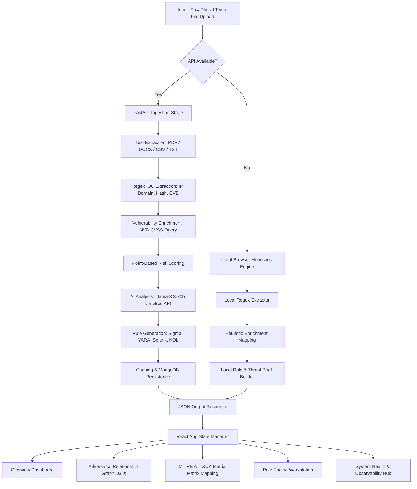

# SISA Sentinel: AI Threat Intelligence & Attack Mapping Platform

SISA Sentinel is a premium, real-time **AI-Powered Threat Intelligence and Adversarial Attack Mapping Platform** built for the **SISA AI-Prism Hackathon 2026**. The platform automates threat ingestion, extracts Indicators of Compromise (IOCs), queries vulnerability directories, assesses risk scoring under rigorous mathematical frameworks, maps tactics to the MITRE ATT&CK® matrix, generates multi-format SIEM/detection rules, and displays network relations interactively.

---

## 🏗️ Architecture & Pipeline Flow

The platform is designed with a high-performance **modular decoupled architecture**:
*   **Frontend**: A modern React (Vite) application utilizing a customized design system built with custom CSS, glassmorphism aesthetics, responsive layouts, micro-animations, and interactive D3.js force-directed topology maps.
*   **Backend**: An asynchronous Python FastAPI server serving RESTful APIs, integrating MongoDB for data persistence, memory caching for identical inputs, and NVD + Groq LLM orchestration.
*   **Hybrid Engine**: Built with a **High-Fidelity Client-Side Fallback**. If the backend FastAPI server or database is offline, the React frontend seamlessly runs a local browser-based parsing and analysis engine using matching heuristics, local regex extraction, and deterministic rule templates.

### Data Ingestion & Analysis Pipeline (Mermaid)



---

## ⚡ Core Functionality

### 1. Ingestion Pipeline (`F1`)
*   Supports both raw text and file uploads (supporting `.pdf`, `.docx`, `.doc`, `.csv`, `.txt`, `.json`) up to **10MB**.
*   Utilizes python packages `PyPDF2` and `python-docx` on the backend to extract document contents.
*   Uses a fast HTML `FileReader` wrapper client-side to read text when offline.

### 2. Multi-Regex IOC Extraction (`F2`)
*   Extracts structural network and file indicators via high-speed regular expressions:
    *   **Network Elements**: IPv4 addresses, domains, URLs, and emails.
    *   **File Elements**: MD5, SHA-1, and SHA-256 hashes.
    *   **Vulnerabilities**: CVE-IDs (e.g., `CVE-2023-4966`).

### 3. Intel Enrichment & Attribution (`F3`)
*   Performs dynamic lookups for extracted CVE-IDs against the **NVD API** or local database configurations, bringing back description data, CVSS ratings, severity ranks, and public exploit POC availability.
*   Enriches results with malware family profiles and known APT actors (e.g., *APT29 / Cozy Bear*, *APT41 / BARIUM*, *LockBit Group*).

### 4. Dynamic Risk Scoring Engine (`F5`)
Implements a mathematical risk calculation based on point-scoring parameters (capped at 100):
$$\text{Risk Score} = \min(100, \text{CVSS Factor} + \text{Exploit PoC Available} + \text{Malware Assoc} + \text{Actor Known} + \text{IOC Reputation})$$

*   **CVSS Factor**: Critical (CVSS > 9) = 30 pts | High (CVSS 7–9) = 20 pts | Medium (CVSS 4–7) = 10 pts.
*   **Exploit PoC Available**: 25 pts.
*   **Malware Associated**: 15 pts.
*   **Known Threat Actor**: 10 pts.
*   **IOC Reputation (Blacklist hit)**: 20 pts.
*   **Risk Level Mapping**:
    *   `Critical` (>80)
    *   `High` (61–80)
    *   `Medium` (31–60)
    *   `Low` (0–30)

### 5. AI-Powered Threat Briefs (`F4` & `F6`)
*   Communicates with the **Groq API** running `llama-3.3-70b-versatile` to produce dynamic incident summaries, structured attack scenario timelines, and business risk assessments.
*   Maps tactics and techniques into the standard **MITRE ATT&CK Matrix** (e.g., *Initial Access (T1190)*, *Execution (T1204)*) and validates technique IDs against a local MITRE Catalog JSON data source.
*   Recommends mitigation vectors divided into: *Immediate Actions*, *Long-term Remediation*, and *Continuous Monitoring*.

### 6. Detection Rule & SIEM Workstation (`F7`)
*   Compiles rules in four SIEM formats:
    *   **Sigma (YAML)**: Standardized EDR search queries.
    *   **YARA**: Hex/string byte matches for binaries.
    *   **Splunk SPL**: Host/network searching logs.
    *   **Microsoft Sentinel KQL**: Azure DeviceEvents/NetworkConnections queries.
*   Includes a dedicated **Rule Workstation** tab allowing analysts to inspect, modify, and copy generated code rules.

### 7. Interactive D3.js Force Layout Graph (`F8`)
*   Builds an animated node-link relationship chart visualizing the connections between the threat incident, actors, malware files, CVSS vulnerabilities, and individual IOC network targets.
*   Includes a sidebar **Context Inspector** to pin and inspect detailed metadata on specific nodes.

---

## 📂 Codebase Organization

The project is structured as a monorepo containing distinct frontend and backend directories:

```text
SisaHackathon/
├── Backend/                 # FastAPI Python Backend
│   ├── app/
│   │   ├── data/            # Local catalogs (mitre_catalog.json)
│   │   ├── services/        # Pipeline modular stages
│   │   │   ├── ai.py        # LLM integration (Groq API client)
│   │   │   ├── enrichment.py# CVE & actor lookup
│   │   │   ├── extractor.py # Regular expression matches
│   │   │   ├── ingestion.py # Document parsers
│   │   │   ├── risk.py      # Numerical score calculators
│   │   │   └── rules.py     # SIEM/YARA rule builders
│   │   ├── cache.py         # MongoDB caching layer
│   │   ├── config.py        # Environment variables configuration
│   │   ├── database.py      # Async MongoDB driver wrapper (motor)
│   │   ├── schemas.py       # Pydantic contract validators
│   │   └── main.py          # FastAPI application routes & lifespan
│   ├── seed_data.py         # Seed script for initial database entries
│   └── requirements.txt     # Python backend dependencies
│
└── Frontend/                # Vite React App
    ├── src/
    │   ├── components/      # UI components (dashboard widgets)
    │   │   ├── AIReportViewer.jsx
    │   │   ├── DetectionRules.jsx
    │   │   ├── IOCTable.jsx
    │   │   ├── InteractiveGraph.jsx  # D3 force graph layout
    │   │   ├── MitreMatrix.jsx       # MITRE matrix visual grid
    │   │   ├── OverviewDashboard.jsx # System KPIs and widgets
    │   │   ├── RuleEngineHub.jsx     # Rule workstation
    │   │   └── SystemHealth.jsx      # Telemetry diagnostics
    │   ├── services/
    │   │   └── api.js       # API client & client-side fallback heuristics
    │   ├── App.jsx          # Router & main state coordinator
    │   ├── index.css        # Premium HSL CSS design system layout
    │   └── main.jsx
    └── vite.config.js
```

---

## 🛠️ Installation & Setup

### Prerequisites
*   **Python 3.11+**
*   **Node.js (v18+)** & npm
*   **MongoDB Community Server** (running locally on port `27017` or configured via remote URI)

### 1. Backend Setup
1. Navigate to the backend directory:
    ```bash
    cd Backend
    ```
2. Create and activate a python virtual environment:
    ```bash
    python -m venv venv
    # Windows:
    .\venv\Scripts\activate
    # macOS/Linux:
    source venv/bin/activate
    ```
3. Install required packages:
    ```bash
    pip install -r requirements.txt
    ```
4. Create a `.env` file in the `Backend` directory:
    ```env
    GROQ_API_KEY=your_groq_api_key_here
    GROQ_MODEL=llama-3.3-70b-versatile
    MONGODB_URI=mongodb://localhost:27017
    MONGODB_DATABASE=sisa_sentinel
    NVD_API_KEY=your_nvd_api_key_optional
    ```
5. Seed initial demo scenarios into MongoDB:
    ```bash
    python seed_data.py
    ```
6. Start the FastAPI ASGI server:
    ```bash
    uvicorn app.main:app --port 8000 --reload
    ```
    *   API documentation is available locally at `http://localhost:8000/docs`.

### 2. Frontend Setup
1. Navigate to the frontend directory:
    ```bash
    cd ../Frontend
    ```
2. Install Node dependencies:
    ```bash
    npm install
    ```
3. Boot up the Vite developer server:
    ```bash
    npm run dev
    ```
4. Open your browser and direct it to `http://localhost:5173`.

### 3. Running Backend Tests
To execute the comprehensive FastAPI test suite:
1. Navigate to the backend directory:
    ```bash
    cd Backend
    ```
2. Activate your virtual environment and run pytest:
    ```bash
    python -m pytest tests/
    ```

---

## 📝 API Endpoints Reference

### 1. System Health
*   **Endpoint**: `GET /health`
*   **Description**: Returns connection health for MongoDB/Groq and gateway uptime/latency metrics.

### 2. Run Analysis Pipeline
*   **Endpoint**: `POST /api/analyze-threat`
*   **Content-Type**: `application/json`
*   **Payload**:
    ```json
    {
      "content": "Threat intelligence raw string...",
      "input_type": "text",
      "options": {
        "mitre_mapping": true,
        "generate_rules": true,
        "risk_scoring": true
      }
    }
    ```

### 3. File Document Upload
*   **Endpoint**: `POST /api/analyze-threat/upload`
*   **Content-Type**: `multipart/form-data`
*   **Fields**:
    *   `file`: The document binary.
    *   `options`: Stringified options JSON object.

### 4. Fetch Analysis Records History
*   **Endpoint**: `GET /api/analyses`
*   **Query Params**: `page` (int), `pageSize` (int), `risk_level` (str), `input_type` (str), `sort` (str).

### 5. Fetch Single Run
*   **Endpoint**: `GET /api/analyses/{analysis_id}`

---

## 🎯 Seeding & Verification Scenarios
The database populator (`seed_data.py`) contains five preconfigured high-fidelity incidents matching different risk vectors:
1.  **LockBit 3.0 Ransomware (Critical - 95 pts)**: Exploits Citrix Bleed (CVE-2023-4966), executes binaries, connects to Onion C2 targets, deletes shadow copies.
2.  **APT29 Spear Phishing Campaign (High - 85 pts)**: Targeted diplomat spear phishing with lookalike Microsoft domains, RomCom RAT payloads, exploiting CVE-2023-38831.
3.  **Apache ActiveMQ RCE (High - 75 pts)**: OpenWire exploit payloads (CVE-2023-46604) causing command redirection / curl executions.
4.  **ShadowPad RAT Malware Upload (Critical - 90 pts)**: DLL sideloading attack bundle linked with APT41 attribution.
5.  **Shodan Port Scan (Low - 15 pts)**: Standard internet port check noise from benign web crawlers.

---

## 🔗 Key Source References

*   **Backend Main Router**: [main.py](file:///c:/Users/divya/SisaHackathon/Backend/app/main.py)
*   **Config Definitions**: [config.py](file:///c:/Users/divya/SisaHackathon/Backend/app/config.py)
*   **Database Operations**: [database.py](file:///c:/Users/divya/SisaHackathon/Backend/app/database.py)
*   **Extractor service**: [extractor.py](file:///c:/Users/divya/SisaHackathon/Backend/app/services/extractor.py)
*   **AI generation core**: [ai.py](file:///c:/Users/divya/SisaHackathon/Backend/app/services/ai.py)
*   **Risk assessment logic**: [risk.py](file:///c:/Users/divya/SisaHackathon/Backend/app/services/risk.py)
*   **Frontend Main coordinator**: [App.jsx](file:///c:/Users/divya/SisaHackathon/Frontend/src/App.jsx)
*   **API connector & Heuristics core**: [api.js](file:///c:/Users/divya/SisaHackathon/Frontend/src/services/api.js)
